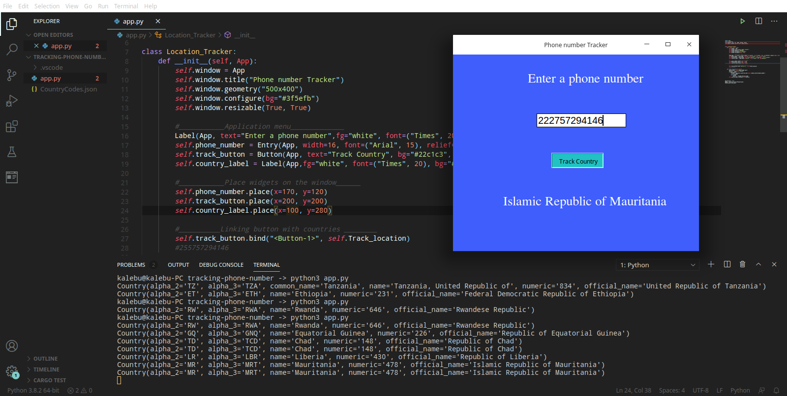
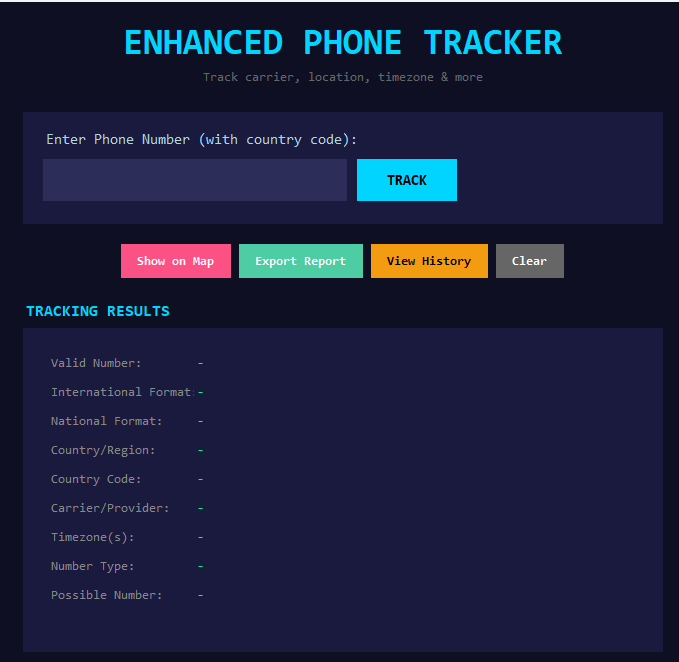
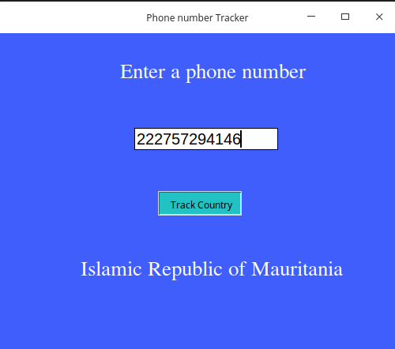
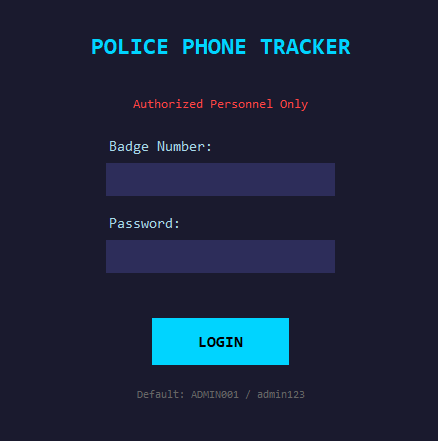
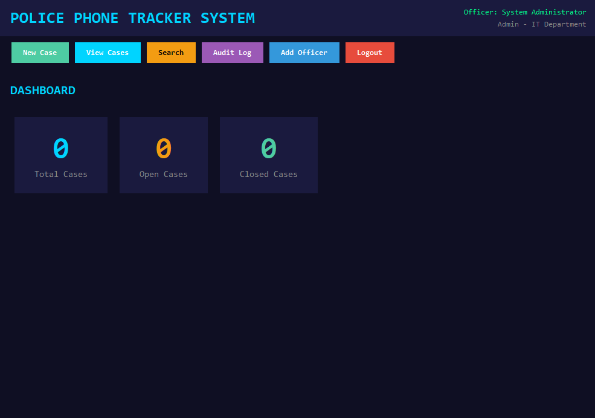

# Python Phone Number Tracker

A comprehensive phone number tracking and analysis toolkit built with Python and Tkinter.

## Applications Included

| App | Description |
|-----|-------------|
| `app.py` | Basic phone tracker - identifies country from phone number |
| `enhanced_tracker.py` | Advanced tracker with carrier, timezone, map visualization |
| `police_tracker.py` | Full case management system for law enforcement |

---

## Quick Start

### Installation

```bash
# Clone the repository
git clone https://github.com/Kalebu/Python-phonenumber-tracker-App
cd Python-phonenumber-tracker-App

# Install dependencies
pip install -r requirements.txt
```

### Run Applications

```bash
# Basic Tracker
python app.py

# Enhanced Tracker (recommended)
python enhanced_tracker.py

# Police Case Management System
python police_tracker.py
```

---

## 1. Basic Tracker (`app.py`)

Simple GUI app that identifies the country from a phone number.



**Features:**
- Country detection from phone number
- Simple Tkinter interface

**Usage:** Enter phone number with country code (e.g., `+255712345678`)

---

## 2. Enhanced Tracker (`enhanced_tracker.py`)

Advanced phone analysis with detailed information and map visualization.



**Features:**
| Feature | Description |
|---------|-------------|
| Number Validation | Checks if number is valid/possible |
| International Format | Shows formatted number |
| Country Detection | Identifies country/region |
| Carrier Lookup | Detects mobile provider (Airtel, Vodafone, etc.) |
| Timezone | Shows timezone(s) for the number |
| Number Type | Mobile, Landline, VoIP, Toll-Free, etc. |
| Interactive Map | Dark-themed map with location marker |
| Export Report | Save detailed report as .txt file |
| Tracking History | View all previously tracked numbers |

**Map Visualization:**



---

## 3. Police Case Management (`police_tracker.py`)

Complete case management system for lost/stolen phone investigations.

### Login Screen


### Dashboard


**Default Login:**
- Badge: `ADMIN001`
- Password: `admin123`

**Features:**

| Feature | Description |
|---------|-------------|
| Officer Authentication | Secure login with badge number & password |
| Dashboard | Overview of case statistics |
| Case Management | Create, view, update, search cases |
| Phone Analysis | Country, carrier, type, timezone detection |
| IMEI Tracking | Store device IMEI for each case |
| Victim Information | Store victim details and incident info |
| Carrier Request Generator | Auto-generate legal request letters |
| Official Reports | Export detailed case reports |
| Audit Logging | Track all officer actions for accountability |
| Multi-Officer Support | Add and manage multiple officers |
| SQLite Database | Persistent local storage |
| Interactive Maps | View phone location on map |

**Workflow:**
1. Login with badge number
2. Create new case
3. Enter phone number & analyze
4. Add victim information
5. Generate carrier request letter
6. Update case status as investigation progresses
7. Export final report

---

## Requirements

```
phonenumbers>=8.13.0
folium>=0.14.0
pycountry>=22.3.5
phone-iso3166>=0.6.2
```

---

## Test Phone Numbers

| Number | Country |
|--------|---------|
| +14155552671 | United States |
| +447911123456 | United Kingdom |
| +255712345678 | Tanzania |
| +919876543210 | India |
| +49301234567 | Germany |
| +33123456789 | France |

---

## Legal Disclaimer

This toolkit provides information derived from phone number formats using publicly available data. It does **NOT**:
- Provide real-time GPS tracking
- Access private subscriber information
- Intercept calls or messages
- Track live location

For law enforcement use, proper legal authorization (court orders/warrants) is required to obtain subscriber information from carriers.

---

## Project Structure

```
Python-phonenumber-tracker-App/
├── app.py                 # Basic tracker
├── enhanced_tracker.py    # Advanced tracker
├── police_tracker.py      # Police case management
├── police_tracker.db      # SQLite database (auto-created)
├── phone_location_map.html # Generated map file
├── requirements.txt       # Dependencies
├── CountryCodes.json      # Country code reference
├── README.md              # This file
└── images/
    ├── image1.png
    └── image2.png
```

---

## Credits

- Original project by [Kalebu](https://github.com/kalebu)
- Enhanced version with additional features
- Uses Google's [libphonenumber](https://github.com/google/libphonenumber) via `phonenumbers` library

---

## License

Open source - free to use for educational purposes.
